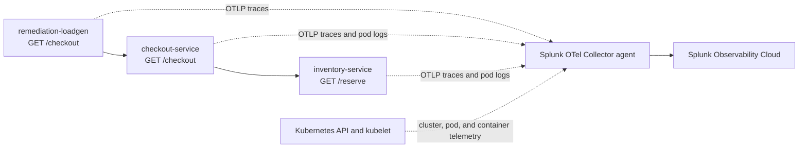

The lab application is a small checkout workflow built for this incident exercise. It is intentionally simple so students can quickly understand the request path, telemetry, and injected failure.

The source lives in `workshop/ai-troubleshooting-remediation`.

## What the App Does

The app models one customer action: checkout during a winter storm demand spike.

- `remediation-loadgen` sends steady `/checkout` traffic.
- `checkout-service` accepts checkout requests and calls `inventory-service`.
- `inventory-service` reserves inventory or creates the controlled lab issue.



The Splunk OpenTelemetry Collector receives OTLP traces from the app and collects pod logs, Kubernetes events, and infrastructure metrics.

## How Instrumentation Is Added

The app uses both automatic and custom OpenTelemetry instrumentation.

### Auto Instrumentation Example

Automatic instrumentation creates the baseline service map and HTTP spans. The image installs OpenTelemetry packages for FastAPI, outbound HTTP requests, logging, and OTLP export:

```text
opentelemetry-distro
opentelemetry-exporter-otlp
opentelemetry-instrumentation-fastapi
opentelemetry-instrumentation-requests
opentelemetry-instrumentation-logging
```

During the Docker build, the image runs:

```dockerfile
RUN opentelemetry-bootstrap -a install
```

At runtime, Kubernetes starts each process through the OpenTelemetry launcher:

```yaml
command:
  - opentelemetry-instrument
  - uvicorn
  - checkout_service:app
```

The same pattern is used for `inventory-service`, and the load generator starts with:

```yaml
command:
  - opentelemetry-instrument
  - python
  - loadgen.py
```

This creates spans for inbound FastAPI requests and outbound `requests` calls. The `tracecontext` propagator keeps the load generator, checkout service, and inventory service in one trace without manual trace propagation code.

The Kubernetes manifest supplies the service identity and export path:

- `OTEL_SERVICE_NAME` names each APM service as `checkout-service`, `inventory-service`, or `remediation-loadgen`.
- `OTEL_RESOURCE_ATTRIBUTES` adds `deployment.environment=ai-remediation-workshop`, `service.version=1.0.0`, and `app.workshop=ai-troubleshooting-remediation` for filtering and correlation.
- `OTEL_EXPORTER_OTLP_ENDPOINT=http://$(NODE_IP):4317` sends telemetry to the node-local Splunk OpenTelemetry Collector agent.
- `OTEL_EXPORTER_OTLP_PROTOCOL=grpc` uses the OTLP gRPC receiver exposed by the collector agent.

### Custom Instrumentation Example

Custom instrumentation adds business and failure context to the automatic spans.

In `checkout_service.py`, the service adds checkout context and creates a child span around the inventory dependency:

```python
span = trace.get_current_span()
span.set_attribute("app.cart.type", cart)
span.set_attribute("app.cart.value", cart_value)
span.set_attribute("app.sku", sku)
span.set_attribute("service.version", SERVICE_VERSION)

with tracer.start_as_current_span("checkout.reserve_inventory") as reserve_span:
    reserve_span.set_attribute("app.sku", sku)
    reserve_span.set_attribute("app.quantity", quantity)
```

When inventory fails, the code records the exception and marks the span as an error:

```python
reserve_span.record_exception(exc)
reserve_span.set_status(Status(StatusCode.ERROR, str(exc)))
span.set_status(Status(StatusCode.ERROR, "inventory request failed"))
```

In `inventory_service.py`, the service adds the active issue mode:

```python
span = trace.get_current_span()
span.set_attribute("app.issue_mode", mode)
span.set_attribute("app.sku", sku)
span.set_attribute("app.quantity", quantity)
span.set_attribute("app.cart.type", cart)
```

These custom attributes are intentionally simple:

- `app.cart.type`: set by `checkout-service` and `inventory-service` to show which simulated cart path the request used.
- `app.cart.value`: set by `checkout-service` to show the approximate business value of the checkout request.
- `app.sku`: set by `checkout-service` and `inventory-service` to show the product involved in the checkout.
- `app.quantity`: set by `checkout-service` and `inventory-service` to show the quantity reserved.
- `app.issue_mode`: set by `inventory-service` to show whether the service is healthy, slow, erroring, or crash-looping.
- `app.checkout.duration_ms`: set by `checkout-service` to show end-to-end checkout duration observed by the service.

Together, the app gives the AI troubleshooting agent APM latency, errors, traces, span attributes, Kubernetes health, restarts, and logs.

## Issue Modes

The app supports three operating modes:

- `latency-errors`: `inventory-service` sleeps and fails a percentage of requests. `checkout-service` becomes slow and returns errors. Use this for an APM service latency or error-rate alert.
- `crashloop`: `inventory-service` exits at startup, causing Kubernetes restarts. Use this for a Kubernetes pod restart, unavailable workload, or crash-loop alert.
- `healthy`: services respond normally. Use this for remediation and recovery validation.

{}

* Clone or open this repository on the machine where you will run the workshop commands.
* Change into the lab app directory:

```bash
cd workshop/ai-troubleshooting-remediation
```

* Review the directory structure:

```bash
find . -maxdepth 3 -type f | sort
```

* Open these files and identify where telemetry and issue modes are configured:
  * `app/checkout_service.py`
  * `app/inventory_service.py`
  * `k8s/app.yaml`
  * `scripts/inject-issue.sh`


{}
**Why does this workshop use Kubernetes even for local laptop deployment?**
{}
{}
**The feature supports APM service alerts and Kubernetes Infrastructure Monitoring alerts. Running the app in Kubernetes lets students practice both supported alert paths with the same sample app.**
{}


{}
