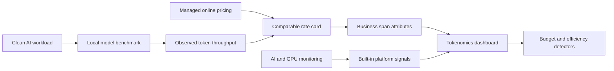

AI platforms need cost visibility at two levels: the application layer that consumes
tokens, and the infrastructure layer that runs local, on-prem, or cloud capacity.
**Splunk Observability Cloud** and **Splunk AI Agent Monitoring** provide the first
layer: AI request traces, token usage, estimated cost, service context, and
infrastructure health. Chargeback requires one additional layer of intent: stable
business attribution that connects those built-in signals to business units, users,
tenants, workloads, models, and outcomes.

This workshop starts with a clean local AI workload and turns it into an observable,
cost-aware workload. By the end, students can answer four questions:

* **What does this AI workload cost?**
* **Who is consuming it?**
* **Is the infrastructure healthy?**
* **Should it run locally, on-prem, or in cloud?**

The primary lab path runs on a local model, so students do not need a Kubernetes
cluster. If you have a Cisco AI Pods or GPU cluster environment, the same model extends
to out-of-the-box GPU telemetry.

* Run a clean Ollama-backed AI workload with no custom instrumentation.
* Benchmark a local model with Ollama or an OpenAI-compatible local endpoint.
* Derive internal token rates from observed throughput and hourly accelerator cost.
* Compare local derived rates with managed online model pricing.
* Use public GPU hourly data as a market proxy when no internal rate card exists.
* Enable out-of-the-box AI monitoring views for token usage, estimated cost, and traces.
* Add OpenTelemetry span attributes for business and user attribution.
* Estimate internal token cost per request when local or unsupported models need a lab
  rate card.
* Analyze token cost per request, BU, user, tenant, team, workload, and model.
* Compare cost to outcome: accepted answers, drafts created, or requests needing review.
* Allocate shared GPU or local accelerator cost from utilization, allocation, or
  measured throughput.
* Build dashboard views and detectors that FinOps, platform, and application teams can
  use without exporting data to a separate spreadsheet.

## Workshop Flow

## What You Need

* Access to a Splunk Observability Cloud organization.
* A laptop or workstation that can run a local model with Ollama. CPU-only works for
  the lab; a local GPU makes the economics more realistic.
* Python 3.11 or later for the clean app, instrumented app, and simulator scripts.
* Optional: a monitored Kubernetes or OpenShift environment with GPU workloads.
* Optional: the Cisco AI Pods collector and NIM examples from the **Monitoring Cisco AI
  Pods** workshop, or equivalent NVIDIA DCGM and NIM Prometheus metrics.
* Permission to view dashboards, Infrastructure Monitoring, APM, traces, detectors, and
  Metric Finder.
* A public managed online model price, public GPU hourly proxy, or internal hardware
  amortization value.

{}
This workshop can run as a standalone local-model lab. The **Monitoring Cisco AI Pods**
and **Monitoring Agentic AI Applications** workshops provide optional production-style
telemetry, but they are not required to learn the economics model.
{}

## What You Will Build

By the end of the workshop, you will have a working pattern for:

* AI request attribution with `ai.team`, `ai.cost_center`, `ai.tenant.id`,
  `ai.business_unit`, `ai.user.id`, `ai.workload.name`, `ai.outcome.category`, and
  `gen_ai.request.model`.
* A derived token rate card from local benchmark data.
* Built-in token usage and estimated-cost views from AI monitoring where supported.
* Request-level internal cost attributes for local or unsupported model paths.
* Local-vs-online and on-prem-vs-cloud comparison formulas based on throughput and
  public pricing.
* Infrastructure health views for latency, errors, and optional GPU utilization.
* A dashboard layout for executive summary, team breakdown, model economics, and GPU
  efficiency or placement decisions.
* Simulated token surge, tenant misuse, and unknown attribution scenarios.
* Detectors for cost spikes, budget burn, inefficient GPU use, and runaway token growth.
